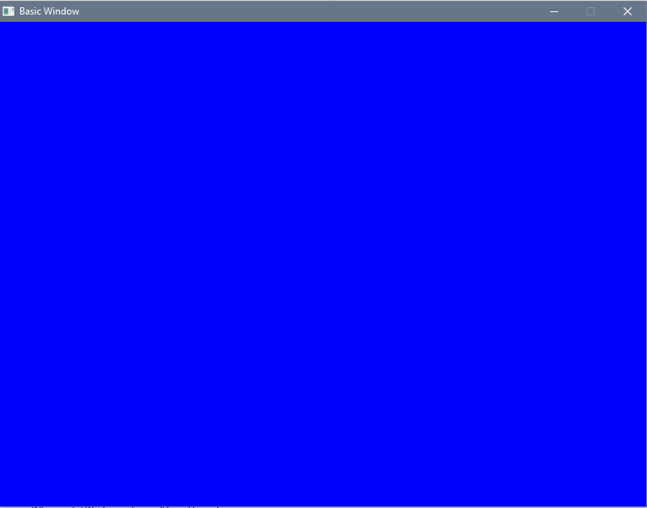

## csfml-fpc

[SFML/CSFML](http://www.sfml-dev.org/) headers binding for the Free Pascal Compiler.

* Basic example
```pascal
program basic;

{$mode objfpc}{$H+}

uses {$IFDEF UNIX} {$IFDEF UseCThreads}
  cthreads, {$ENDIF} {$ENDIF}
  Classes,
  SysUtils,
  CSFMLGraphics,
  CSFMLWindow,
  CSFMLConfig,
  CSFMLSystem { you can add units after this };

var
  mode: sfVideoMode;
  event: sfEvent;
  window: PsfRenderWindow;
  shape: PsfCircleShape;
  position: sfVector2f;
begin
  event := Default(sfEvent);
  shape := sfCircleShape_create();
  position.x := 100.0;
  position.y := 100.0;
  sfCircleShape_setRadius(shape, 40.0);
  sfCircleShape_setPosition(shape, position);
  sfCircleShape_setFillColor(shape, sfCyan);

  mode.Width := 800;
  mode.Height := 600;
  mode.bitsPerPixel := 32;

  window := sfRenderWindow_create(mode, 'basic window', sfUint32(sfClose), nil);
  sfWindow_setFramerateLimit(PsfWindow(window), 60);
  if not Assigned(window) then
    raise Exception.Create('cant create window');

  while sfRenderWindow_isOpen(window) = sfTrue do
  begin
    while sfRenderWindow_pollEvent(window, @event) = sfTrue do
    begin
      if event.type_ = sfEvtClosed then
        sfRenderWindow_close(window);
    end;

    sfRenderWindow_clear(window, sfBlue);
    sfRenderWindow_drawCircleShape(window, shape, nil);
    sfRenderWindow_display(window);
  end;

  sfRenderWindow_destroy(window);
end.                                                 
end.
```




